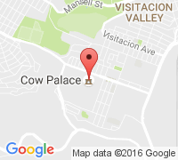

Woo Travel
==========

This is a WordPress theme based on [underscores](http://underscores.me) and [bootstrap](http://getbootstrap.com/) which features integration with [Woocommerce](https://wordpress.org/plugins/woocommerce/) and [Event Organiser](https://wordpress.org/plugins/event-organiser/).
The main purpose of this theme is travelling merchants who will be selling their goods at scheduled events while also having an online storefront. It includes special navigation bar buttons for the Event List, Cart, and Account Page as well as an auto-generated featured products and events carousel. The front page also includes special sections for Featured Products, New Products, Upcoming events, and even an "About Us". 

Options
-------
Most options can be found in the `Plugin Integration` section of the customizer. Most of these should be more or less self-explanitory. Included are options to turn the navigation buttons on or off as well as adjustments for the the top carousel. 

Carousel Google Map
-------------------
Carousel slides for events feature a google map to the venue location which should look like this: 

(*This is a map to the Cow Palace in Daly City at zoom level 13*)

Due to bugs relating to placing JavaScript maps inside bootstrap carousels, the carousel slides instead use the static maps api. As such, you will have to enable it in the [Google API Console](https://console.developers.google.com/apis/api/static_maps_backend/overview) with the same account and project you use for your API key for Event Organiser. Feel Free to experiment with the zoom level control in the customizer. I've found 13 generally gives a decent reference frame. Users will see a more precise map and address when they click on the event, so don't fret too much about it.